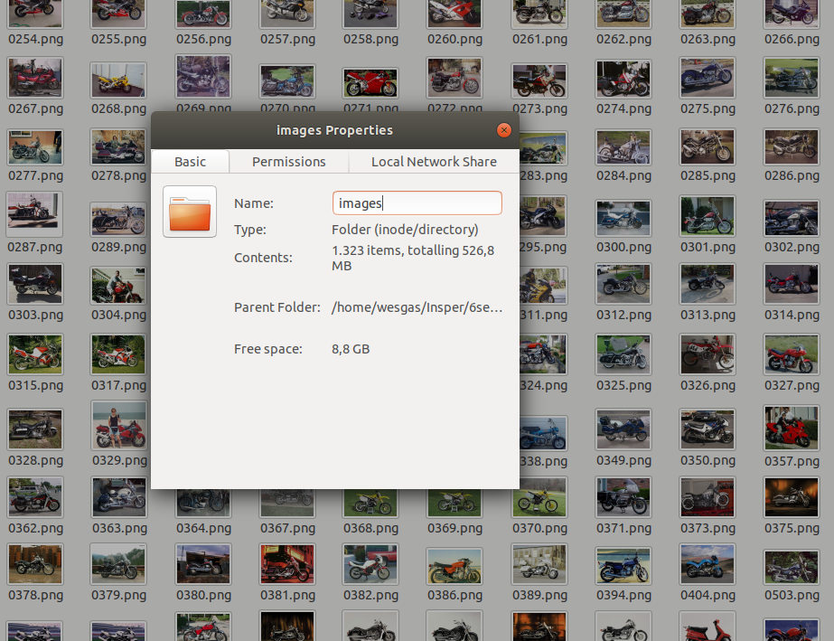

# Sparkly Mosaic
### Pipeline completa para criação de mosaicos a partir de um banco com um grande numero de imagens

As imagens de um diretório são primeiramente indexados. Essa indexação tem como base duas operações:

1. Conversão do espaço de cores
2. Obtenção da média
3. Estruturação binária.

A conversão é utilizada para representar melhor as diferenças de cores observadas pela visão humana, fazendo com que as cores tenham menor prioridade do que o contraste entre claro-escuro.

A média é utilizada para obter um único pixel, que representará a imagem como um todo.

A estruturação binária é necessária para reduzir o tempo de busca na etapa de construção de uma imagem nova, funcionando da seguinte maneira:

O bit

rep| L | A | V
---| --- | --- | ---
Dec | L | A | V
Bin | L1_L0 | A1_A0 | V1_V0
Final | L1_A1_V1_L0_A0_V0

Ex:

rep| L | A | V
---| --- | --- | ---
Dec | 255 | 140 | 10
Bin | 11111111 | 10001100 | 1010
Final | 110100100100111110101100

Após estas operações, o caminho até a imagem junto com sua representação binária são guardados em um banco relacional. Nele, é aplicado uma indexação do tipo B-Tree.

A B-Tree é a estruturação que possibilita a busca quase que instantânea uma vez que a complexidade de busca de qualquer elemento é  O(log(n)) e, mesmo que as inserções sejam de maior complexidade, estas só ocorrem uma vez.

### Montagem do mosaico

A imagem alvo, imagem a ser transformada em mosaico, também é transformada para o espaço LAV, porém, ao contrario das imagens do banco, ela é dividida em pedaços, "chunks", e apenas nestes pedaços é que a obtenção da média e a estruturação binária acontecem.

O número de pedaços é setado pelo usuário, podendo ser de 1 ao número de pixels da imagem alvo.

Então, para cada pedaço, uma função de busca usa o banco relacional de modo a encontrar a imagem que melhor se encaixe. Iniciando com uma tolerância zero (igual), até o total de 24 bits (totalmente diferente).

Cada pedaço carrega consigo a posição de origem na imagem alvo, assim, uma função pode usá-lo, juntamente com o resultado da função de busca, para preencher um canvas (imagem vazia) formando o mosaico.

